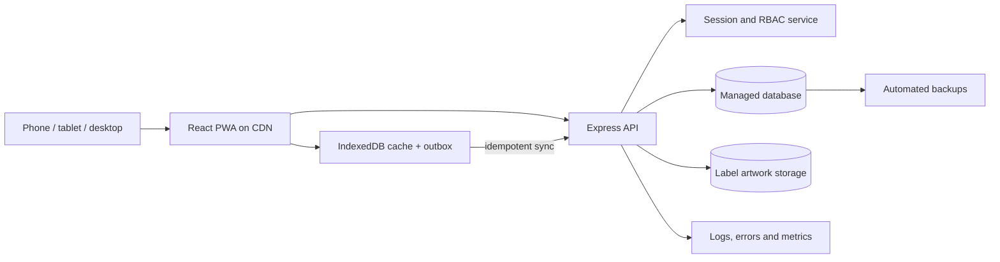

# Akudha Production Readiness Plan

**Updated:** 26 September 2026  
**Target:** A secure, recoverable, multi-user system that can run daily inventory, label printing, sourcing, processing and distribution operations.

## Implementation status — 26 September 2026

Release 1 and the core Release 2 vertical slice are implemented in the application. This includes secure cookie sessions, refresh rotation, administrator-managed staff IDs and six-digit PIN resets, server-side role/region/hub enforcement, strict request schemas, one hardened API topology, MongoDB inventory records, transactional idempotent movements, IndexedDB storage, retrying outbox synchronization, explicit legacy catalogue import, full snapshot pull, label-template metadata APIs and balance reconciliation. Frontend Release 1 is also live with a semantic Tailwind theme, responsive role-aware application shell, durable `/app/...` routes, one synchronization status model, a work-queue home and protected administrator Operations tools.

Vercel Development and Preview now use a managed MongoDB Atlas staging replica set in Cape Town, while Vercel Production uses a separate Atlas resource and the `akudha_production` database. The live deployment at `https://akudha.vercel.app` has passed database connectivity, transaction, bootstrap administrator, secure login, authenticated inventory and four-product offline synchronization checks. Optional GTINs use a repaired partial unique index and all four products without GTINs synchronize successfully. Production now has 16 approved built-in templates and records immutable print jobs with operator, product, optional lot, barcode, physical size, template checksum and copy count; repeat prints require a reason. On 26 September 2026, the first AES-256-GCM encrypted production backup was restored into isolated staging collections: its checksum, 10 collection counts and cleanup were verified in 19 seconds.

The Staff ID and six-digit PIN transition was deployed to production on 8 October 2026 (`dpl_57bYShTRsm7rPoUpFVkdikxj1mi5`). Production now authenticates with unique staff IDs, bcrypt-hashed PINs, account-level temporary lockout after five failed attempts, administrator PIN reset with session revocation, and protected staff lifecycle controls. The bootstrap administrator and managed MongoDB migration were verified through the live login endpoint.

| Release | Status | Remaining gate |
|---|---|---|
| Release 1 · secure server | Complete | Independent security review and recovery runbook. |
| Release 2 · durable inventory | Core path complete | Concurrency tests and moving the older sourcing, processing and distribution display caches from `localStorage` to IndexedDB. |
| Release 3 · labels and workflows | Partial | Move approved artwork to object storage, add template administration, calibrate target printers and verify barcode scans. |
| Release 4 · operations | Early | CI browser tests, monitoring, alerts, scheduled off-workstation backup retention and an operating-day pilot. |

## Production definition

Akudha is production-ready when:

- every user has an individual account and server-enforced permissions;
- the server database is the source of truth and every write has an audit trail;
- devices can work offline and safely synchronize without double-posting stock;
- inventory quantities can be reconciled from immutable stock movements;
- labels are versioned, traceable to a product and batch, and scanner-tested;
- staging and production deploy automatically from reviewed code;
- backups, monitoring, alerts and recovery procedures are tested;
- the critical workflows pass automated browser tests on desktop and mobile.

## Current production blockers

| Priority | Current state | Production outcome |
|---|---|---|
| P0 | The first encrypted production backup and staging restore drill completed successfully on 26 September 2026. Atlas Free has no managed snapshots, and the verified archive currently exists only on this workstation. | Schedule encrypted backups to off-workstation storage, define retention, name the restore owner and repeat the measured drill regularly. |
| P0 | Production has platform logs but no application error tracking or actionable alerts. | Structured logs, error tracking, uptime monitoring and alerts for failed sync and reconciliation differences. |
| P1 | Built-in artwork ships with the frontend and uploaded artwork is device-local. | Versioned object storage, approval workflow and server-owned template dimensions/checksums. |
| P1 | Sourcing, processing and distribution writes reach protected APIs, while their display caches remain in `localStorage`. | IndexedDB caches and one linked traceability chain from harvest through finished product and dispatch. |
| P1 | Unit/API checks exist, but there is no CI browser suite or merge gate. | Automated login, inventory, offline retry, label export and permission tests on desktop and mobile. |
| P1 | Low-stock and expiry states are visible within inventory, but there is no shared work queue or notification ownership. | Role-specific operational queues with acknowledgement and escalation. |
| P1 | Printer dimensions are configurable, but physical calibration and scanner acceptance have not been recorded. | Approved label measurements, printer profiles and successful scans on target hardware. |

## Target architecture

Keep the current React, TypeScript, Express and Mongoose foundation for the first production release. Use a managed MongoDB deployment with replica-set transactions and unique indexes. Reconsider PostgreSQL only if reporting, accounting or complex relational workflows outgrow this model.

## Canonical data model

The server should own these records:

- **Organization** — Akudha tenant, settings, locale, currency and label defaults.
- **User** — identity, status, role, assigned region/hub and last activity.
- **Product** — SKU, owned GTIN, unit, price, cost, reorder point and active state.
- **InventoryLot** — product, lot number, manufactured date, expiry date and received quantity.
- **StockMovement** — immutable receipt, sale, transfer, adjustment or write-off with actor and idempotency key.
- **LabelTemplate** — product, artwork version, physical dimensions, approval status and checksum.
- **LabelPrintJob** — template version, barcode value, lot, dates, copies, actor and timestamp.
- **Harvest / ProcessingBatch / Consignment** — linked by traceability identifiers instead of isolated sample datasets.
- **AuditEvent** — actor, action, target, timestamp, device and before/after metadata for sensitive changes.

Stock on hand must be calculated from movements or updated in the same database transaction. Clients must never submit an authoritative balance.

## Release sequence

### Release 1 — secure server foundation

- Replace the role picker as authority with individual authentication.
- Issue short-lived secure sessions; rotate refresh tokens and support logout/revocation.
- Apply role and region/hub authorization to every API route.
- Add runtime request validation and reject unknown fields.
- Add security headers, strict production CORS, body-size limits and rate limiting.
- Remove the public debug route and return consistent request IDs and error shapes.
- Move API URLs, database settings and AI model configuration to validated environment variables.

**Gate:** An unauthenticated request cannot read or mutate business data, and a field user cannot access another region.

### Release 2 — durable inventory and real synchronization

- Add server models and APIs for products, lots, stock movements and label templates.
- Migrate current browser catalogue data through an explicit import screen.
- Replace `localStorage` operational storage with IndexedDB.
- Implement an outbox with idempotency keys, exponential backoff and terminal failure handling.
- Add pull synchronization using a server cursor and updated timestamps.
- Define conflict rules: append-only movements, server-owned balances and explicit review for product edits.
- Add daily reconciliation that compares movement totals with stored lot balances.

**Gate:** The same offline sale synchronized multiple times creates one movement, and two devices converge on the same stock balance.

### Release 3 — label and workflow hardening

- Store barcode-free master artwork in versioned object storage.
- Require approved physical dimensions and a template status before production printing.
- Preserve the template checksum and barcode value on every print job.
- Validate GTIN check digits and keep SKU/GTIN uniqueness at database level.
- Add print calibration, a scanner verification step and a reprint reason.
- Add low-stock, expiring-lot and failed-sync work queues to the dashboard.
- Replace technical tabs and demo terminology with role-specific daily task views.

**Gate:** A printed label can be traced to its exact product, lot, template version and operator.

### Release 4 — quality, deployment and operations

- Add database-backed integration tests for every mutation and permission boundary.
- Add browser tests for login, receive stock, sell stock, write-off, offline sync and label export.
- Add CI for install, typecheck, tests, build, dependency audit and deploy preview.
- Maintain separate staging and production environments with separate databases and storage.
- Add structured logs, error tracking, uptime checks and alerts for sync failures and reconciliation differences.
- Automate backups and perform a documented restore test before launch.
- Add retention, privacy, incident-response and user-support procedures.

**Gate:** A failed release rolls back safely, a backup restore is proven, and the critical browser suite passes before deployment.

## Product polish required for a production feel

The detailed frontend audit, target information architecture and phased implementation gates are in [`FRONTEND_UPGRADE_PLAN.md`](./FRONTEND_UPGRADE_PLAN.md).

- Open directly into the signed-in user's work queue instead of a marketing page and role-selection demo.
- Use a persistent application shell with a clear location, account menu and global status.
- Show actionable states: syncing, saved, failed, needs review, expiring and low stock.
- Replace diagnostic controls with an administrator-only operations area.
- Add onboarding for products, printers, label dimensions and the first stock receipt.
- Use consistent tables, filters, pagination, confirmation patterns and success receipts.
- Provide settings for organization details, phone number, units, currency, barcode policy and printers.
- Meet keyboard, contrast, focus, touch-target and screen-reader accessibility requirements.

## First implementation slice

Build the vertical path below before expanding more screens:

1. Authenticated user signs in.
2. User creates or edits a server-backed product.
3. User receives a lot and creates an immutable stock movement.
4. User generates a label from an approved barcode-free template.
5. The print job is audited with product, lot, template version and barcode.
6. Another device sees the new product, lot and stock balance.
7. The workflow continues offline and synchronizes exactly once when connectivity returns.

Completing this slice establishes the reusable foundation for sales, write-offs, sourcing, processing and distribution.

## Launch criteria

- No demo PIN, open mutation endpoint, public debug endpoint or hard-coded production URL.
- All P0 security findings closed and independently reviewed.
- Database indexes and transaction behavior tested under concurrency.
- Critical API and browser tests pass in CI.
- Offline duplicate, partial failure and conflict scenarios pass.
- Printer calibration and barcode scan tests pass on the target printers and scanners.
- Monitoring, alert ownership, backup restoration and rollback are demonstrated.
- Pilot users complete a full operating day without developer intervention before general rollout.
